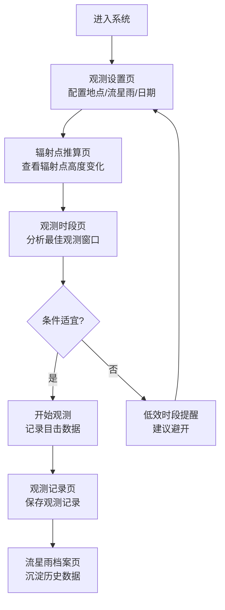

## 1. 产品概述

流星雨观测预报辐射点高度与最佳观测时段生产力系统，面向天文爱好者与观星活动组织者，提供专业的流星雨观测规划与记录功能。系统通过精确的天文算法计算辐射点高度、可见流量、月光干扰等关键参数，帮助用户识别最佳观测窗口，提升观测效率与成功率。

- **核心价值**：将复杂的天文计算自动化，让普通爱好者也能获得专业级的观测规划建议
- **目标用户**：天文爱好者、观星活动组织者、摄影爱好者、学生科普教育

## 2. 核心 Features

### 2.1 用户角色

| 角色 | 注册方式 | 核心权限 |
|------|----------|----------|
| 天文爱好者 | 无需注册，纯前端离线使用 | 所有功能完整使用，本地存储观测数据 |

### 2.2 功能模块

1. **观测设置页**：观测地点配置（经纬度、海拔）、流星雨群选择、观测日期设置、环境参数（云量、光污染）
2. **辐射点推算页**：辐射点赤经赤纬输入、当夜逐时地平高度计算、高度曲线可视化、方位角计算
3. **观测时段页**：天顶流量(ZHR)与实际可见流量换算、月相/月升月落计算、光害干扰时段识别、黄金观测窗计算、朝向与视野推荐
4. **观测记录页**：目击计数记录、天气条件记录、观测时段记录、数据统计分析
5. **流星雨档案页**：历年极大数据沉淀、流星雨群资料库、历史观测记录归档

### 2.3 页面详情

| 页面名称 | 模块名称 | 功能描述 |
|---------|---------|----------|
| 观测设置页 | 地点配置 | 经纬度输入、海拔输入、常用地点预设、自动获取当前位置 |
| 观测设置页 | 流星雨选择 | 内置主流流星雨群数据库、自定义流星雨参数、辐射点赤经赤纬设置 |
| 观测设置页 | 环境参数 | 云量等级选择、光污染等级选择、极限星等校验 |
| 辐射点推算页 | 高度计算 | 按小时计算辐射点地平高度、方位角、上升/下落时间 |
| 辐射点推算页 | 可视化图表 | 24小时高度曲线图、高度热力图、升起/落下时刻标注 |
| 辐射点推算页 | 低效提醒 | 辐射点未升起时段提醒、高度过低提醒 |
| 观测时段页 | 流量换算 | ZHR到实际可见流量的换算公式、辐射点高度修正、极限星等修正 |
| 观测时段页 | 月光干扰 | 月相计算、月升月落时间、月光光害等级、暗弱流星可见度评估 |
| 观测时段页 | 黄金窗口 | 辐射点高度适宜、无月光干扰的时段识别、极大值时刻偏差影响分析 |
| 观测时段页 | 朝向推荐 | 最佳观测朝向、视野范围建议、避开月光方向 |
| 观测记录页 | 记录列表 | 历史观测记录列表、按流星雨/日期筛选 |
| 观测记录页 | 新建记录 | 目击流星计数、起止时间、天气状况、备注信息 |
| 观测记录页 | 统计分析 | 观测时长统计、流星总数、每小时实际流量计算 |
| 流星雨档案页 | 群资料库 | 象限仪座、英仙座、双子座等主流流星雨群详细资料 |
| 流星雨档案页 | 历年数据 | 历年极大值日期、ZHR峰值、观测记录归档 |
| 流星雨档案页 | 数据导入导出 | JSON格式导入导出、数据备份 |

## 3. 核心流程

**用户主流程描述**：
1. 用户进入系统后，首先在观测设置页配置观测地点（经纬度、海拔）、选择目标流星雨群、设置观测日期和环境参数（云量、光污染等级）
2. 系统自动跳转或用户手动切换到辐射点推算页，查看当夜辐射点的逐时高度变化曲线，了解辐射点何时升起、何时达到最佳高度
3. 在观测时段页，系统综合计算可见流量、月光干扰时段，识别出黄金观测窗口，给出朝向建议
4. 如果当前条件不适宜（辐射点未升起或被月光淹没），系统给出明确的避开提醒
5. 观测完成后，用户在观测记录页记录目击流星数、天气状况等信息
6. 所有观测数据自动沉淀到流星雨档案页，形成个人观测历史

## 4. 用户界面设计

### 4.1 设计风格

**整体风格**：深邃星空主题 + 科技感数据可视化

- **主色调**：深空蓝 (#0a0e27)、星夜紫 (#1a1435)、宇宙黑 (#050510)
- **辅助色**：流星黄 (#ffd93d)、极光绿 (#6bcb77)、警示红 (#ff6b6b)、月光银 (#c9d1d9)
- **按钮样式**：圆角渐变按钮，hover时有微弱发光效果，边框使用细线条
- **字体**：标题使用 Orbitron 或类似科技感字体，正文使用 Inter 或系统无衬线字体，数字等宽字体使用 JetBrains Mono
- **布局风格**：卡片式布局，毛玻璃效果背景，数据可视化区域突出显示
- **图标风格**：线性图标配合填充，使用天文相关符号（★ ☽ ★流星辐射点等）
- **背景**：深色渐变背景，叠加微妙的星点纹理，营造星空氛围

### 4.2 页面设计概述

| 页面名称 | 模块名称 | UI 元素 |
|---------|---------|---------|
| 观测设置页 | 地点配置 | 地图占位区、经纬度输入框、海拔输入、预设地点下拉选择 |
| 观测设置页 | 流星雨选择 | 流星雨卡片列表、搜索框、参数编辑面板 |
| 观测设置页 | 环境参数 | 滑块组件、等级指示器、极限星等实时计算显示 |
| 辐射点推算页 | 高度图表 | SVG/Canvas 折线图、时间轴、高度刻度、峰值标注 |
| 辐射点推算页 | 数据面板 | 关键数值卡片（最大高度、升起时间、下落时间） |
| 辐射点推算页 | 时段列表 | 逐小时数据表格、适宜度颜色标记 |
| 观测时段页 | 流量换算 | 计算公式展示、参数调节滑块、结果数值动画 |
| 观测时段页 | 月光干扰 | 月相图标、月升月落时间轴、光害等级色条 |
| 观测时段页 | 黄金窗口 | 高亮时段卡片、倒计时显示、极大值时刻标注 |
| 观测时段页 | 朝向推荐 | 方位罗盘示意图、视野扇形图、避让方向标注 |
| 观测记录页 | 记录列表 | 时间线布局、记录卡片、筛选标签 |
| 观测记录页 | 新建记录 | 表单弹窗、计数器组件、天气选择器 |
| 观测记录页 | 统计面板 | 数字统计卡片、趋势小图表 |
| 流星雨档案页 | 群资料库 | 网格布局卡片、详情展开面板 |
| 流星雨档案页 | 历年数据 | 时间轴、数据表、对比图表 |

### 4.3 响应式设计

- **设计策略**：桌面端优先，移动端自适应
- **断点**：1200px（桌面）、768px（平板）、480px（手机）
- **移动端适配**：导航转为底部Tab栏，图表自适应宽度，表格转为卡片列表
- **触摸优化**：增大点击区域（最小44px），支持滑动手势切换页面

### 4.4 动效设计

- **页面切换**：淡入淡出 + 轻微滑动过渡，300ms 缓动
- **数据加载**：骨架屏占位，数据显示时从下往上滑入
- **数值变化**：数字滚动动画，高亮脉冲效果
- **图表交互**：hover 时数据点放大，显示详细数据 tooltip
- **观测提醒**：低效时段使用呼吸灯效果，重要提醒使用弹窗动画
