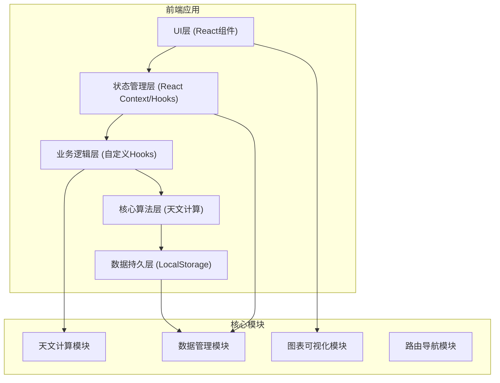
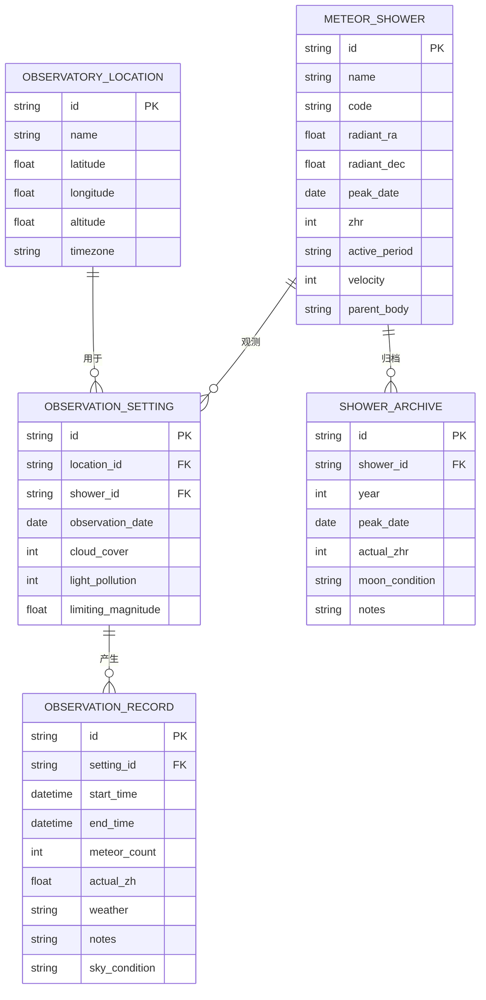

## 1. 架构设计



**架构说明**：
- 纯前端单页应用，无后端服务，完全离线可用
- 数据通过 LocalStorage 持久化存储在浏览器本地
- 采用分层架构，核心天文算法独立封装，便于测试和复用
- 使用 React Hooks 进行状态管理，避免引入复杂的状态管理库

## 2. 技术描述

### 2.1 核心技术栈

| 层级 | 技术选型 | 版本 | 用途 |
|------|----------|------|------|
| 构建工具 | Vite | 5.x | 项目构建、热更新、打包 |
| UI框架 | React | 18.x | 组件化开发 |
| 语言 | TypeScript | 5.x | 类型安全 |
| 样式 | TailwindCSS | 3.x | 原子化CSS |
| 路由 | React Router DOM | 6.x | 单页路由 |
| 图表 | Recharts | 2.x | 数据可视化（高度曲线等） |
| 图标 | Lucide React | 0.x | 图标库 |
| 日期处理 | date-fns | 3.x | 日期时间计算 |

### 2.2 核心算法库（自研）

- **astronomy.ts**：天文计算核心库
  - 儒略日计算
  - 恒星时计算
  - 赤道坐标转地平坐标（高度角、方位角）
  - 月相计算
  - 月亮位置计算（月升月落）
  - 太阳位置计算（日出日落）
  - 极限星等计算
  - 可见流星流量换算

## 3. 路由定义

| 路由 | 页面名称 | 功能 |
|------|---------|------|
| / | 观测设置页 | 地点、流星雨、环境参数配置 |
| /radiant | 辐射点推算页 | 辐射点高度计算与可视化 |
| /observation | 观测时段页 | 最佳观测窗口分析 |
| /records | 观测记录页 | 观测记录管理 |
| /archive | 流星雨档案页 | 流星雨资料库与历史数据 |

## 4. 数据模型

### 4.1 数据实体关系



### 4.2 核心数据结构定义

```typescript
// 观测地点
interface Location {
  id: string;
  name: string;
  latitude: number;      // 纬度 (度，北纬为正)
  longitude: number;     // 经度 (度，东经为正)
  altitude: number;      // 海拔 (米)
  timezone: string;      // 时区，如 'Asia/Shanghai'
}

// 流星雨群
interface MeteorShower {
  id: string;
  name: string;          // 中文名
  code: string;          // 国际代码
  radiantRA: number;     // 辐射点赤经 (度)
  radiantDec: number;    // 辐射点赤纬 (度)
  peakDate: string;      // 极大日期 (MM-DD)
  zhr: number;           // 天顶流量
  activeStart: string;   // 活动开始日期 (MM-DD)
  activeEnd: string;     // 活动结束日期 (MM-DD)
  velocity: number;      // 流星速度 (km/s)
  parentBody: string;    // 母体
  magnitude: number;     // 平均星等
}

// 观测设置
interface ObservationSetting {
  id: string;
  locationId: string;
  showerId: string;
  observationDate: string;  // YYYY-MM-DD
  cloudCover: number;       // 云量 0-10
  lightPollution: number;   // 光污染等级 1-9 (Bortle)
  limitingMagnitude: number; // 极限星等
}

// 辐射点高度数据
interface RadiantData {
  time: Date;
  altitude: number;     // 地平高度 (度)
  azimuth: number;      // 方位角 (度，从正北顺时针)
  isVisible: boolean;   // 是否可见
}

// 月亮数据
interface MoonData {
  time: Date;
  altitude: number;     // 月亮高度
  azimuth: number;      // 月亮方位
  phase: number;        // 月相 0-1 (0=新月, 0.5=满月, 1=新月)
  illumination: number; // 照亮率 0-1
  isUp: boolean;        // 是否在地平线上
}

// 观测时段
interface ObservationWindow {
  startTime: Date;
  endTime: Date;
  quality: 'excellent' | 'good' | 'fair' | 'poor';
  avgRadiantAltitude: number;
  avgMeteorRate: number;
  moonInterference: 'none' | 'low' | 'medium' | 'high';
  reason: string;
}

// 观测记录
interface ObservationRecord {
  id: string;
  settingId: string;
  startTime: string;    // ISO datetime
  endTime: string;      // ISO datetime
  meteorCount: number;  // 目击流星数
  actualZH: number;     // 实际每小时流量
  weather: string;      // 天气状况
  skyCondition: string; // 天空状况
  notes: string;        // 备注
  createdAt: string;
}

// 流星雨档案
interface ShowerArchive {
  id: string;
  showerId: string;
  year: number;
  peakDate: string;     // YYYY-MM-DD
  observedZHR: number;
  moonPhase: number;
  moonIllumination: number;
  notes: string;
  recordIds: string[];  // 关联的观测记录
}
```

## 5. 核心模块设计

### 5.1 天文计算模块 (`src/utils/astronomy.ts`)

核心算法函数：

| 函数名 | 输入 | 输出 | 描述 |
|--------|------|------|------|
| `julianDate(date)` | Date | number | 计算儒略日 |
| `localSiderealTime(date, longitude)` | Date, number | number | 计算地方恒星时 |
| `equatorialToHorizontal(ra, dec, lst, latitude)` | 赤经, 赤纬, 地方恒星时, 纬度 | {altitude, azimuth} | 赤道坐标转地平坐标 |
| `calculateRadiantAltitude(shower, date, location)` | MeteorShower, Date, Location | RadiantData | 计算辐射点高度 |
| `calculateMoonPosition(date, location)` | Date, Location | MoonData | 计算月亮位置 |
| `calculateMoonPhase(date)` | Date | {phase, illumination} | 计算月相 |
| `calculateSunPosition(date, location)` | Date, Location | {altitude, azimuth} | 计算太阳位置 |
| `isNightTime(date, location)` | Date, Location | boolean | 判断是否为夜间 |
| `calculateLimitingMagnitude(lightPollution, altitude, moonAlt, moonPhase)` | 光污染等级, 天顶高度, 月亮高度, 月相 | number | 计算极限星等 |
| `calculateVisibleRate(zhr, radiantAlt, limitingMag, showerMag)` | ZHR, 辐射点高度, 极限星等, 流星平均星等 | number | 计算可见流星率 |
| `findGoldenWindows(radiantData, moonData, date, location)` | RadiantData[], MoonData[], Date, Location | ObservationWindow[] | 寻找黄金观测窗口 |

### 5.2 数据存储模块 (`src/utils/storage.ts`)

使用 LocalStorage 实现数据持久化，封装 CRUD 操作：

- `getLocations()` / `saveLocation()` / `deleteLocation()`
- `getShowers()` / `saveShower()` / `deleteShower()`
- `getSettings()` / `saveSetting()` / `deleteSetting()`
- `getRecords()` / `saveRecord()` / `deleteRecord()`
- `getArchives()` / `saveArchive()` / `deleteArchive()`
- `exportData()` / `importData()` - 数据导入导出

### 5.3 状态管理模块 (`src/context/AppContext.tsx`)

使用 React Context 管理全局状态：

- 当前选中的观测地点
- 当前选中的流星雨
- 当前观测日期
- 计算结果缓存

### 5.4 常量数据 (`src/data/`)

- `showers.ts` - 内置主流流星雨群数据（象限仪座、英仙座、双子座等约20个）
- `locations.ts` - 常用观测地点预设
- `constants.ts` - 天文常数、计算公式常量

## 6. 目录结构

```
src/
├── components/          # 公共组件
│   ├── Layout.tsx       # 页面布局（导航栏、内容区）
│   ├── Navbar.tsx       # 顶部导航
│   ├── Card.tsx         # 通用卡片组件
│   ├── Slider.tsx       # 滑块组件
│   ├── DataTable.tsx    # 数据表格
│   └── Loading.tsx      # 加载状态
├── pages/               # 页面组件
│   ├── Settings.tsx     # 观测设置页
│   ├── Radiant.tsx      # 辐射点推算页
│   ├── Observation.tsx  # 观测时段页
│   ├── Records.tsx      # 观测记录页
│   └── Archive.tsx      # 流星雨档案页
├── hooks/               # 自定义Hooks
│   ├── useAstronomy.ts  # 天文计算Hook
│   ├── useLocalStorage.ts # 本地存储Hook
│   └── useObservation.ts # 观测逻辑Hook
├── utils/               # 工具函数
│   ├── astronomy.ts     # 天文计算核心算法
│   ├── storage.ts       # 本地存储封装
│   └── format.ts        # 格式化工具
├── data/                # 静态数据
│   ├── showers.ts       # 流星雨数据库
│   ├── locations.ts     # 常用地点
│   └── constants.ts     # 常量定义
├── types/               # TypeScript类型定义
│   └── index.ts
├── context/             # 状态管理
│   └── AppContext.tsx
├── App.tsx              # 应用入口
├── main.tsx             # React入口
└── index.css            # 全局样式
```

## 7. 关键算法说明

### 7.1 辐射点高度计算

赤道坐标系转地平坐标系的核心公式：

```
A = 方位角
h = 地平高度
δ = 赤纬
φ = 观测者纬度
H = 时角 = 地方恒星时 - 赤经

sin(h) = sin(φ)·sin(δ) + cos(φ)·cos(δ)·cos(H)
cos(h)·sin(A) = cos(δ)·sin(H)
cos(h)·cos(A) = cos(φ)·sin(δ) - sin(φ)·cos(δ)·cos(H)
```

### 7.2 可见流星流量换算

实际可见流星数 = ZHR × 修正因子：

```
修正因子 F = sin(h)^γ × 10^(-0.4×(lm - r)) × k
其中：
h = 辐射点地平高度
γ = 天顶角指数（通常取1.0）
lm = 观测者极限星等
r = 流星群平均星等（视星等）
k = 云量修正（0-1）
```

### 7.3 黄金观测窗判定条件

满足以下所有条件即为优质观测时段：
1. 太阳高度 < -18°（天文昏影终）
2. 辐射点高度 > 30°（越高越好）
3. 月亮高度 < 0° 或 月相 < 0.15（无月光或新月）
4. 云量 < 30%

### 7.4 极限星等计算

考虑光污染、天光背景、月光影响：

```
lm = 7.5 - 0.5×Bortle等级 - 月光修正项
月光修正项 = 1.5 × 月相照亮率 × exp(-月亮高度/20°)
```

## 8. 性能与离线策略

- **纯前端**：无任何后端依赖，所有计算在浏览器完成
- **本地存储**：使用 LocalStorage 存储用户数据，容量约5MB
- **数据导入导出**：支持 JSON 格式导入导出，方便数据备份和迁移
- **缓存策略**：计算结果在页面生命周期内缓存，避免重复计算
- **响应式**：使用 CSS 媒体查询和 Tailwind 响应式类适配各种屏幕
- **PWA支持**：可配置 service worker 实现完全离线使用（可选增强）
